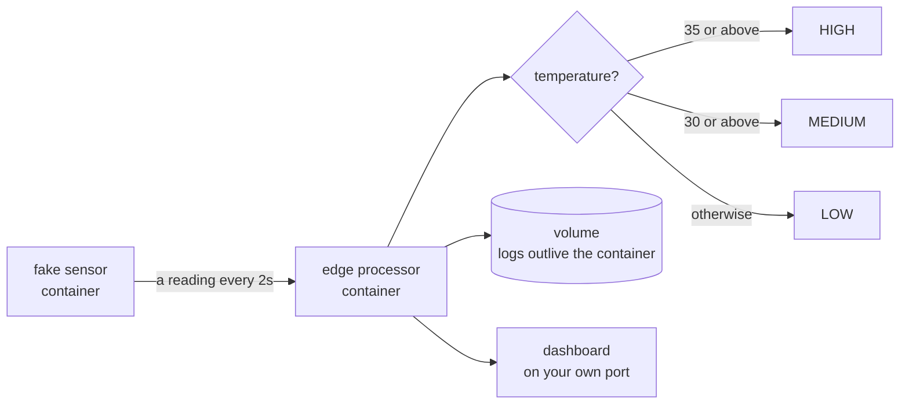
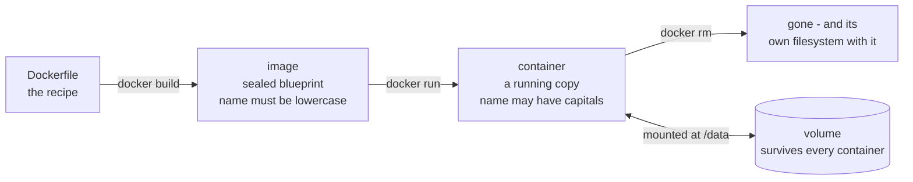

# 00 — Docker Hands-On: A Small Edge System in Boxes

*The warm-up. Build a miniature version of the whole course in one sitting.*

## In one sentence

You build a tiny pretend edge system — a fake sensor sending readings to a
processor that decides whether they're dangerous, saves them, and shows them on
a web page — and you do it entirely with **containers**, the packaging idea the
rest of the course is built on.

## What this is really about

A **container** is a program plus everything it needs to run, sealed in a box.
Not a whole pretend computer — just an isolated, sealed-off program. That's the
trick that makes it small enough to run several on a modest device.

Why anyone bothers: the box you build on your laptop is the same box that runs
on the machine in the field. "Works on my machine" stops being an excuse.

The system you build looks like this:

    Fake Sensor → Edge Processor → Local Log Files → Dashboard

The sensor invents readings like `{"temperature": 34.2, "motion": true,
"battery": 76}`. The processor decides on the spot whether that's a HIGH,
MEDIUM, or LOW risk — **locally**, without asking the internet. That's the
entire thesis of edge computing in one `if` statement.

The risk decision happens **on the device**, in one `if`. Nothing asks the
internet for permission. That is the entire thesis of edge computing.

## What you actually do

Eleven short parts:

- **Get a port of your own.** Everyone shares one machine, so everyone gets a
  different numbered door. Yours is worked out from your username automatically.
- **Prove containers work** — run a throwaway one and look around inside it.
- **Run a web server** in a container and open it in your browser.
- **Build your own sensor container** from scratch — write the code, write the
  recipe file, build the image, run it, watch readings print every two seconds.
- **Add storage that survives.** A container's own filesystem vanishes when the
  container does. So you attach a **volume** — storage that outlives any single
  container — and prove it by deleting the container and reading the data back
  from a fresh one. This is exactly what an edge device does when the network
  is down: keep the data locally until it can be sent.
- **Run several containers as one system** with a single description file, and
  start the whole pipeline with one command.
- **Break it on purpose.** Kill just the processor and watch the sensor start
  reporting failures. Bring it back and watch it recover. Real edge systems
  live in this state; you should see it early.
- **Watch what it costs** — live CPU, memory, and network use per container,
  then deliberately squeeze one into half a processor and 128 MB to see it
  cope.
- **Reach the graphics chip from inside a container** — run the same container
  once with the GPU denied and once granted, and see the difference appear.

## Why it matters later

This is the pattern for everything that follows. Lab 03 puts a data collector
in a container. Lab 04 adds a database and a dashboard. Lab 09 runs ten
copies of one device container as a simulated fleet. Same idea each time,
bigger each time.

The lifecycle worth memorising — note which arrow destroys data and which does
not:

## Words you'll meet

- **Image** — the sealed blueprint. **Container** — a running copy of it.
- **Volume** — storage managed outside the container so data survives.
- **Compose** — describing several containers as one system in a single file.
- **Port** — a numbered door on a machine that a service listens at.

## The one thing to remember

The container is disposable. The volume is not. Know which of your data is in
which.
