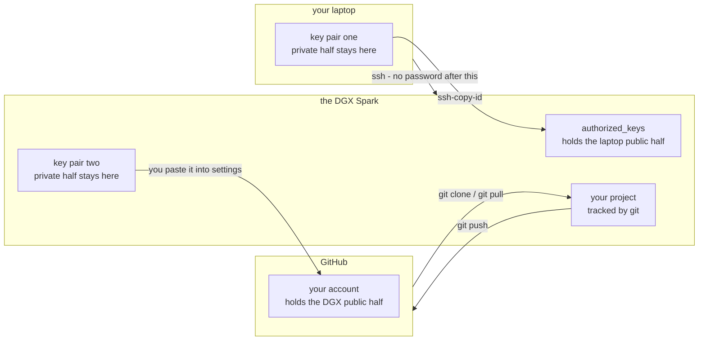
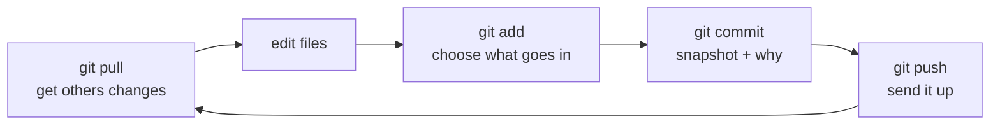

# 01 — SSH, Linux, Git and GitHub

*How to reach a machine you can't touch, and never lose your work.*

## In one sentence

You set up the everyday working habits of remote development: securely logging
in to a computer somewhere else, doing work there, and keeping a tracked
history of that work backed up online.

## What this is really about

Edge devices live in vehicles, factories, closets, and light poles. You will
almost never be sitting in front of one. So the first real skill is reaching
one safely over a network, and the second is making sure your work survives
the device.

**SSH** is the secure tunnel. It checks two identities: the machine's (so you
know you're talking to the right box and not an impostor) and yours.

**Keys instead of passwords.** You generate a matched pair of files. The
private one never leaves your computer; the public one gets copied to anything
that should recognise you. After that you log in without typing a password, and
there's no password to steal. The rule that matters: never share the private
one. Ever.

**Git** is the other half. It keeps a history of your files — every change,
who made it, when, and why — so you can see what changed and go back. **GitHub**
is a place on the internet to keep a copy of that history, which is how work
moves between machines and how it survives one dying.

The part that trips people up is that there are **two separate key pairs**, and
each private half never moves:

## What you actually do

This lab has an unusual shape worth knowing about: the notebook runs *on the
class machine*, but the first six parts are about connecting *to* it from your
own computer. So those parts are commands you type on your own laptop, and the
notebook is careful to label which is which.

- Get the machine's address and your account name from your instructor, and
  connect for the first time.
- Understand what SSH actually checked when it connected.
- Create a key pair, copy the public half to the machine, log in without a
  password.
- Then switch to working *on* the machine: make a project folder, write a small
  script, run it.
- Start tracking that folder with Git: stage changes, save a snapshot with a
  message, look at the history. Learn to view exactly what changed, and to tell
  Git to *ignore* files that shouldn't be tracked (logs, temporary junk).
- Give the class machine its own key for GitHub — separate from your laptop's —
  and add it to your GitHub account.
- Push your project up, then clone it back down fresh, proving the history
  travelled with it. Practice the everyday cycle: pull, edit, add, commit, push.
- Finally, troubleshooting: what actually goes wrong (wrong username, wrong
  address, key permissions too open, key never added) and how to see it.

## Why it matters later

Every remaining lab starts with you already on the machine. And every project
you'd want to keep should be in Git. This lab is the only one that sets up the
connection itself.

The everyday cycle, once the connection exists:

## Words you'll meet

- **SSH** — an encrypted connection for logging into a remote machine.
- **Key pair** — a private file you keep secret and a public file you hand out.
- **Repository ("repo")** — a folder whose history Git is tracking.
- **Commit** — one saved snapshot, with a message saying why.
- **Push / pull / clone** — send your history up, bring changes down, make a
  fresh local copy.

## The one thing to remember

The private key proves you are you. Treat it like a house key, not a business
card.
