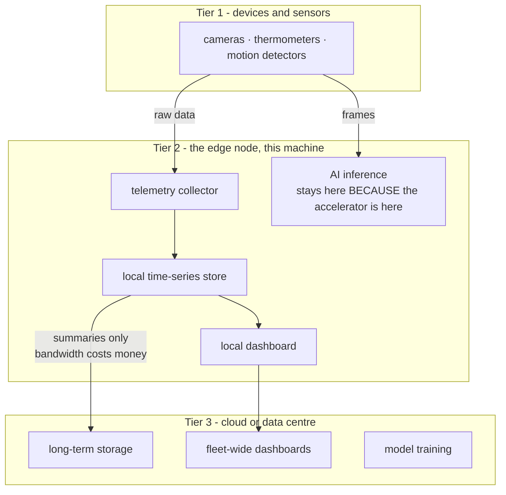
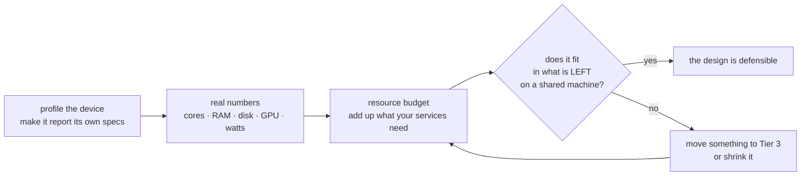

# 02 — System Architecture and Design

*Measure the machine first. Then decide what it should run.*

## In one sentence

You interrogate the class machine until it tells you exactly what it is — cores,
memory, storage, graphics chip, power, heat, and how busy it already is — then
use those real numbers to decide what work belongs on the device and what
belongs in the cloud, and finally turn part of that design into actually
running containers.

## What this is really about

Architecture sounds like drawing boxes and arrows. The point this lab makes is
that a diagram isn't a design until you've proved the device can *carry* it.

So the lab runs in two halves. First, **profiling**: never assume a device's
specs, make the device report them itself. Second, **design**: use those
numbers to justify every placement decision.

Edge systems are usually thought of in three layers:

    Tier 1: Sensors and devices    — cameras, thermometers, motion detectors
    Tier 2: The edge node          — the machine near the data (this one)
    Tier 3: Cloud / data centre    — long-term storage, fleet views, training

The interesting decisions are all about which tier something goes in, and every
one of them should be justified by a real constraint: latency, privacy,
bandwidth cost, available compute, or having to keep working when the network
is down.

Every arrow crossing a tier boundary should be justified by a real constraint:
latency, privacy, bandwidth, available compute, or having to keep working when
the network is down.

## What you actually do

**Profiling (Parts 1–9):** count the cores and check how loaded they already
are; read total and available memory; look for the graphics chip and its
tooling; check disk space; watch live system load stream past in a terminal;
read power and temperature limits. Then you fold all of those commands into one
script that produces a single dated report — a reusable tool rather than a
one-off.

A recurring, deliberate lesson: **the machine is shared.** The load you see
includes everyone else's work. Designing for it means designing for whatever
capacity is left, not for an empty machine. That's not a classroom artifact —
it's the actual condition of most edge hardware.

**Design (Part 10):** write a document that places each piece of the system in
a tier, says *why*, and includes a resource budget proving the device can run
it. Then commit it with Git, so the design has a history like the code does.

**Containers (Parts 11–18):** turn design into reality. Verify the container
tooling works, run a real dashboard service on your own port, attach storage
that survives a container being deleted, describe two services as one system,
and build a container that reaches the graphics chip — which is the concrete
form of "AI inference stays on the device *because* the device has the
accelerator."

There's an oddly memorable detour in here about naming rules: image names must
be lowercase, container names may have capitals. It seems trivial until it
fails your build with a cryptic message.

## Why it matters later

Everything you deploy for the rest of the course is one of the Tier-2 services
you budget for here. Lab 03 builds the collector. Lab 04 the database and
dashboard. Lab 05 the AI inference. Lab 09 the fleet.

The order matters more than any single measurement. A diagram is not a design
until the budget proves the device can carry it:

## Words you'll meet

- **Edge node** — the computer doing work near where data is produced.
- **Load average** — roughly, how many processes are queued for the processor.
  Compare it to your core count: near it means busy, well under means headroom.
- **Thermal throttling** — slowing down to avoid overheating, which is why
  sustained speed is lower than peak speed.
- **Resource budget** — adding up what your services need and checking it fits.

## The one thing to remember

Design for the sustained number on a shared machine, not the peak number on an
empty one.
