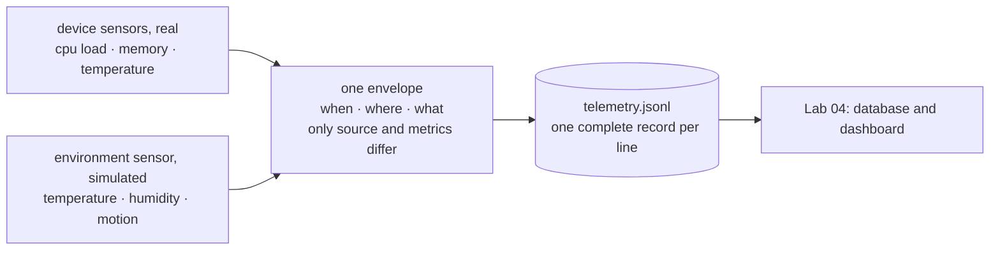
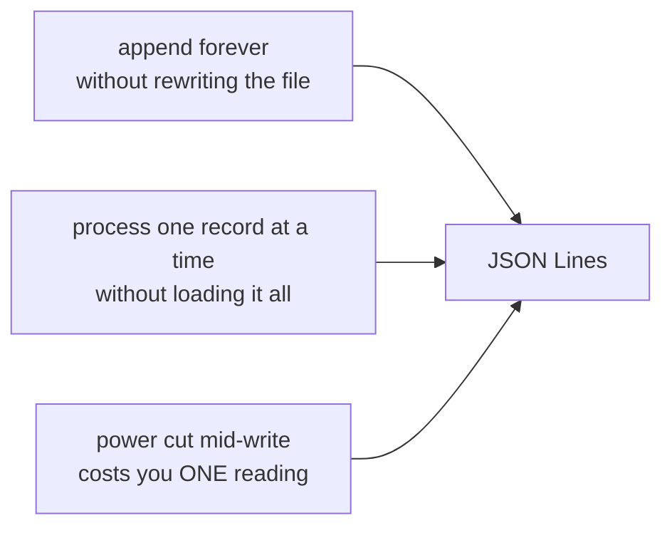

# 03 — Collecting Telemetry

*Getting measurements out of a device, reliably, in a shape anything can read.*

## In one sentence

You build a program that samples the machine's real sensors plus one simulated
environment sensor on a schedule, and writes each reading as a single
self-contained line of structured text — which becomes the raw material for
every lab after this.

## What this is really about

**Telemetry** is just measurement that's collected automatically and stamped
with a time. Every good reading answers three questions:

    When?   a timestamp
    Where?  which device and which sensor
    What?   the values, with their units

The design idea worth carrying away is the **data contract**: decide the exact
shape of one reading *before* you write the collector, then never deviate. Every
reading looks the same, so anything downstream — a database, a dashboard, an
alerter — can read it without surprises. Sensors differ; the envelope doesn't.

The format is one complete record per line. That sounds like a small detail and
it is not. It means you can append forever without rewriting the file, process
the file one record at a time without loading it all, and lose only one reading
if the power fails mid-write.

Two very different sources, one identical envelope — that sameness is what lets
a single pipeline handle any sensor you add later:

## What you actually do

- **Read the machine's genuine sensors** — processor load, memory, temperature.
  These come from ordinary files the operating system exposes. No extra
  hardware.
- **Decide the reading format** and write it down as an example.
- **Build the collector.** It reads the real sensors, adds a simulated
  environment sensor, and emits both in the *same* envelope with only the
  source and the values differing. That sameness is exactly what lets one
  pipeline handle many sensor types.
- **Put it in a container** writing to storage that persists — so it starts
  automatically, stays isolated, and its data survives it.
- **Look at what you collected** and filter it — pull just the temperatures out
  of the stream.
- **Change the sampling rate** and watch the cost. Sample four times faster and
  you get four times the detail and four times the storage and bandwidth. On a
  constrained shared device, the right rate is a design decision, not a default.

## Why it matters later

The file you produce here feeds straight into Lab 04's database. The same
envelope shows up again in Lab 07's alerter and Lab 09's fleet devices. It's the
common currency of the second half of the course.

Why one record per line, rather than one big document:

## Words you'll meet

- **Telemetry** — automatic, time-stamped measurement.
- **Device sensor vs. environment sensor** — the machine measuring itself vs.
  measuring the world around it.
- **JSON Lines** — one complete record per line; easy to append and to stream.
- **Data contract / schema** — the agreed shape of a record.
- **Sampling rate** — how often you take a reading.

## The one thing to remember

A broken sensor should record "missing" and keep going. It should never take
down the whole collector.
