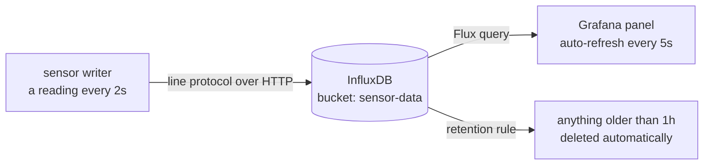
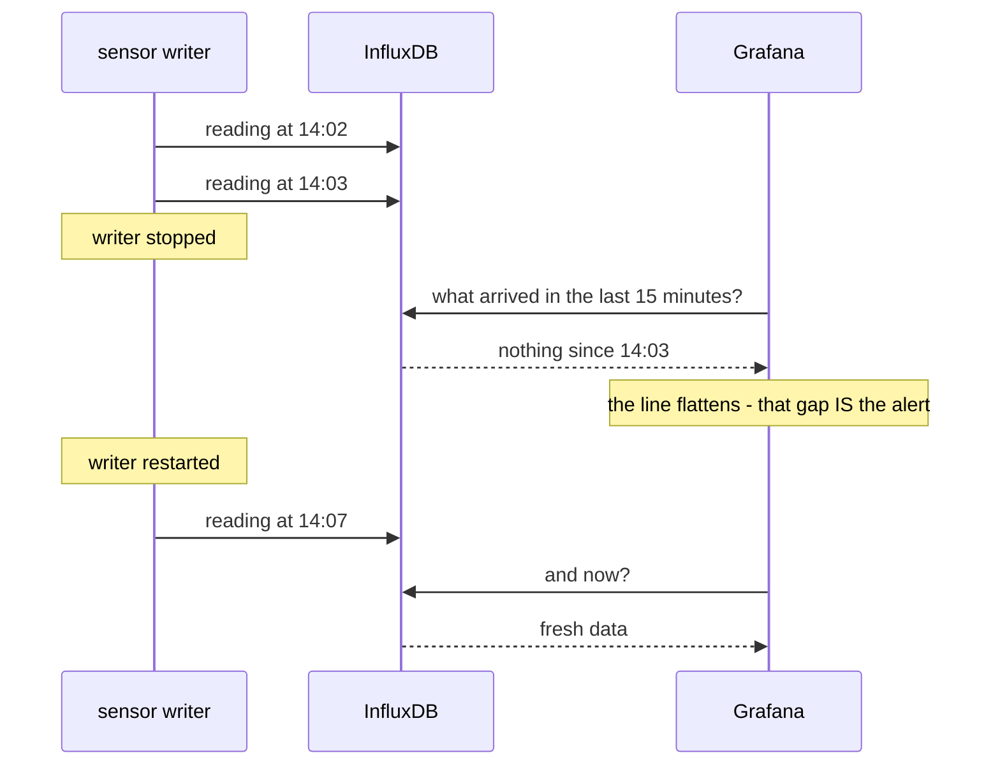

# 04 — Time-Series Database and Grafana

*Somewhere to keep all those readings, and a live picture of them.*

## In one sentence

You store a stream of sensor readings in a database built specifically for
time-stamped data, then point a dashboard tool at it and watch live charts
update as new readings arrive.

## What this is really about

An ordinary database is good at storing *current state*: this customer's
address, this product's price. Sensor data is a different animal — it's
millions of small events, each stamped with a moment, and you almost never ask
"what is it" so much as "how has it changed."

A **time-series database** is built for that shape. It handles enormous numbers
of timestamped points and answers questions like:

    What was the latest reading?
    What was the average temperature over the last 10 minutes?
    Has anything arrived at all in the last minute?

That last one matters more than it looks — it's how you notice a device died.

**Grafana** is the other half: the dashboard tool that turns those questions
into charts on a screen that refresh themselves. Together they're the storage
and visualization layer of the pipeline you've been building.

## What you actually do

- **Get your own ports.** Two this time — one for the database, one for the
  dashboard — worked out from your username so nobody collides.
- **Start the database in a container** and check it answers.
- **Write a single reading by hand** using the database's compact text format,
  through its web interface. Learn to recognise that a *successful* write
  returns nothing at all — no news is the good news.
- **Ask questions** with the database's query language, which reads like a
  pipeline: take this data, narrow to this time range, filter to this field.
- **Build a fake sensor** that writes a fresh reading every two seconds, so
  there's something live to look at.
- **Wire all three together** — sensor, database, dashboard — as one system
  described in a single file. The dashboard's connection to the database is set
  up automatically by a configuration file rather than by clicking through
  screens, which is the difference between a demo and something reproducible.
- **Build a dashboard panel** in the browser, set it to refresh every five
  seconds, and watch a live temperature line.
- **Add a retention rule.** High-frequency data piles up fast. You create a
  storage bucket that automatically throws away anything older than an hour.
  Deciding what to forget is a real design decision at the edge.
- **Simulate a dead sensor.** Stop just the writer and watch the dashboard line
  flatten. That visible gap is exactly how an operator notices a device stopped
  reporting. Then restart it and watch it recover.

## Why it matters later

This closes the loop from Lab 03: you can now collect, store, ask questions of,
and *see* your data. Lab 09's fleet monitor is the same idea scaled to many
devices at once.

The failure drill is the most useful ten seconds in the lab. Nothing raises an
error — the data simply stops, and the flat line is the alarm:

## Words you'll meet

- **Time-series database** — built for many timestamped events rather than
  current state.
- **Measurement / tag / field** — roughly: the table name, the indexed labels,
  the measured numbers.
- **Bucket** — a named container for data, optionally with an expiry rule.
- **Retention policy** — the rule that automatically deletes old data.
- **Data source** — a dashboard's configured connection to a database.

## The one thing to remember

A flat line on a dashboard is data. It usually means something stopped.
