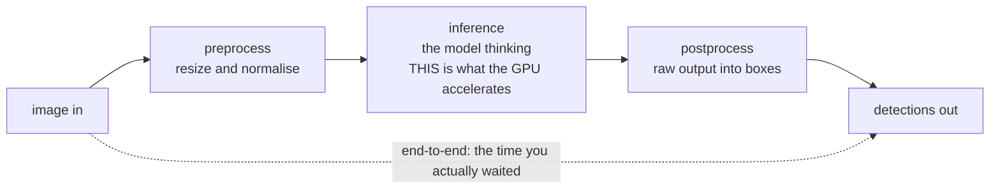
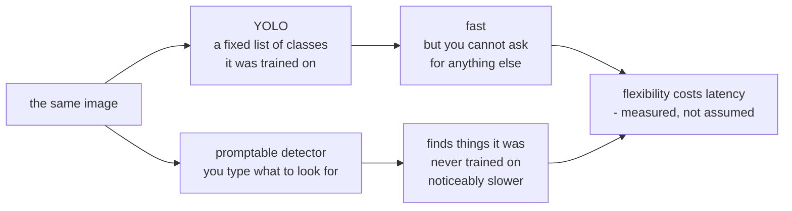

# 05 — Running AI on the Device, and Timing It Honestly

*Detecting things in images, right where the camera is.*

## In one sentence

You run object detection on the class machine's graphics chip using two
different styles of model, and — just as importantly — you measure how long each
detection takes and record those timings in a structured log.

## What this is really about

**Edge AI** means running the model *on the device* instead of shipping every
image to the cloud. The reasons are practical: it's faster (no round trip), it
works when the network doesn't, it doesn't cost bandwidth, and the images never
leave the building — which for cameras is often the whole argument.

You meet two model styles, and the contrast is the point:

- **YOLO** is fast and detects a fixed set of things it was trained on — person,
  car, dog. You cannot ask it for anything else.
- **A promptable "locate anything" model** takes a text description and finds
  that, including things it wasn't specifically trained on. Far more flexible —
  and noticeably slower. Flexibility costs time. Seeing that trade-off measured,
  rather than asserted, is the lesson.

The other half of the lab is about honest timing. **Latency** isn't one number,
it's a chain:

    preprocess   getting the image into the shape the model wants
    inference    the model actually thinking (this is what the GPU speeds up)
    postprocess  turning raw output into boxes on the image
    end-to-end   the total time you actually waited

Speeding up the middle stage while the other two dominate is a classic wasted
optimization, and you can only see that if you measure all four.

Latency is not one number. It is a chain, and only one link is the part the
graphics chip actually speeds up:

Speeding up the middle link while the outer two dominate is a classic wasted
optimization — and you can only see that if you measure all four.

## What you actually do

- Set up the AI environment (either a container the instructor provides or one
  you build — the software versions here are fussy and must match the machine).
- **Run one detection**, look at the boxes it drew, read the timing breakdown.
- **Run the same thing on the processor instead of the graphics chip** and
  compare. The gap is dramatic and it's the whole reason the hardware exists.
- **Build a proper timing logger.** It warms up first (throwing away the first
  few runs), then does 50 runs, recording each one as a structured line. This
  is Lab CC's discipline applied to a real measurement.
- **Run the promptable model**, twice with different text prompts on the *same*
  image, and watch the detections change with the words.
- **Time a realistic workload** — 100 detections in a row while you watch the
  machine's live load in another window. One image is a microbenchmark; a
  stream is the real thing.

## Why it matters later

The logs you produce here are the input to Lab 06, which turns them into proper
statistics, and Lab 07, which tries to make the whole thing faster.

The two model styles, and the trade they represent:

## Words you'll meet

- **Inference** — running a trained model on new input to get a prediction.
- **Warm-up** — the first few runs, discarded because they include one-time
  setup.
- **Latency vs. throughput** — time for one result vs. results per second.
- **Open-vocabulary detection** — a model you steer with a text prompt.
- **FPS** — frames per second, roughly 1000 divided by the average
  milliseconds per frame.

## The one thing to remember

The GPU is shared. If your timings look bad, someone else may be using it —
which is itself a genuine property of edge hardware, not an excuse.
