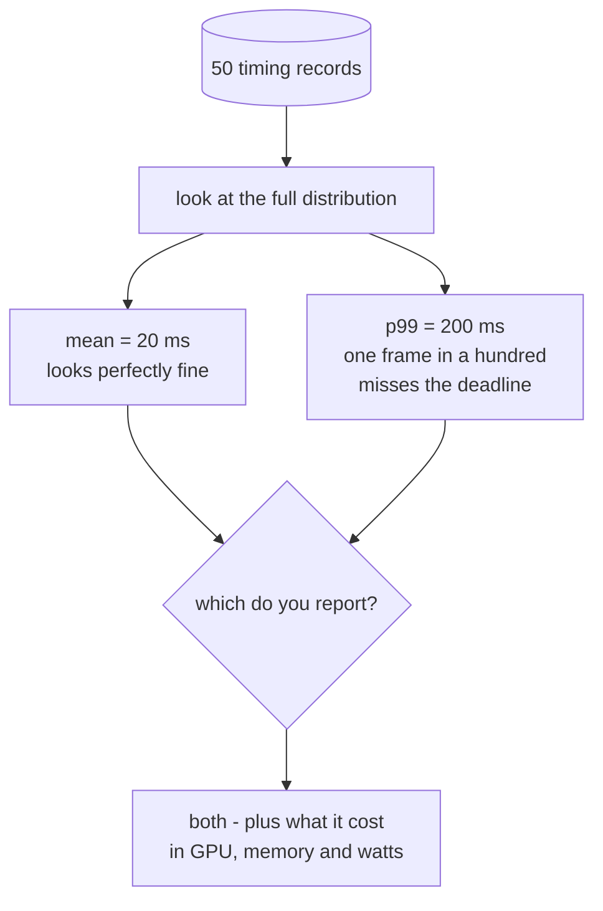
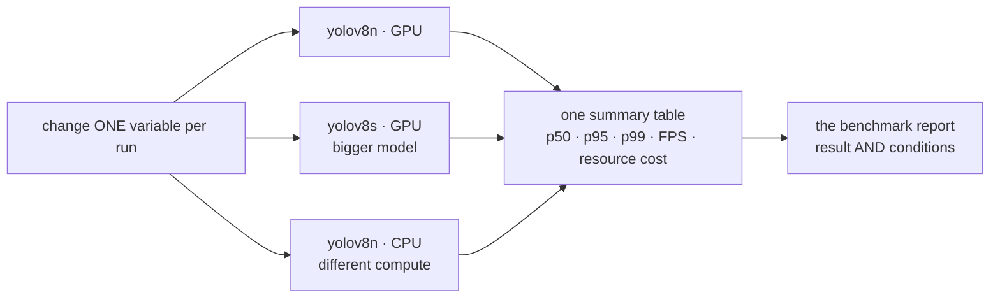
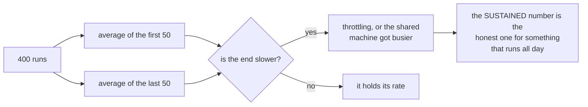

# 06 — Benchmarking and Evaluation

*You logged a pile of numbers. Now find out what they mean.*

## In one sentence

You turn the raw timing logs from the AI lab into an actual evaluation — the
full spread of results rather than an average, what the work cost in processor
and power, a fair comparison of several configurations, and a written report.

## What this is really about

Logging numbers is not the same as understanding them, and an average is
usually the least interesting thing you can say about a set of measurements.

The central idea is **percentiles**. If your detector averages 20
milliseconds but spikes to 200 once a second, the average tells you it's fine
and the reality is that you drop a frame at the worst possible moment. So you
report:

    p50   the median — the typical run
    p95   the value 95% of runs came in under
    p99   the slow tail

At the edge, the tail usually decides whether a system is usable at all,
because a single slow frame can miss a real-time deadline.

Second idea: **speed without cost is half a benchmark.** "40 frames per second"
means nothing until you can say "40 frames per second at 60% GPU, 800 MB, and
25 watts." Only the pair is actionable.

Third idea: **change one thing at a time.** That's what makes a comparison fair
and it's the difference between a sweep and a mess.

The whole lab in one contrast. Both statements below are true of the same
50 measurements, and only one of them predicts whether the system works:

## What you actually do

- **Compute the full distribution** from your logs — minimum, median, mean,
  p95, p99, maximum, and approximate frames per second. Compare processor
  against graphics chip and see both how much faster and how much *more
  consistent* one is. The gap between p50 and p99 is the consistency number.
- **Capture the resource cost** during a run. This genuinely needs two windows
  open at once: one running the work, one sampling the machine's load. Pairing
  them is what makes the result usable.
- **Sweep configurations** — the same test at two model sizes on the graphics
  chip, plus one on the processor for contrast. Bigger model, more accurate,
  slower. Processor only, throughput collapses. Both expected; both now
  measured.
- **Summarize into one table** — one row per configuration. This is the heart
  of any benchmark report.
- **Test sustained load.** 400 runs, long enough for the machine to warm up.
  Compare the first fifty against the last fifty. If the end is slower, the
  device is throttling — or the shared machine got busier. Either way the
  *sustained* number is the honest one for something that runs all day.
- **Write the report** — what you measured, under what conditions, and what to
  do about it. A benchmark nobody wrote down can't be acted on.

## Why it matters later

Lab 07 makes changes and needs a baseline to prove they helped. Without this
lab, "it feels faster" is all you'd have.

A sweep is only fair if exactly one thing changes at a time:

And the sustained-load check, which is what a short benchmark hides:

## Words you'll meet

- **Percentile (p50/p95/p99)** — the value that share of runs came in under.
- **Configuration sweep** — the same test with one variable changed at a time.
- **Resource cost** — what the performance consumed to happen.
- **Repeatability** — same conditions, similar numbers. Otherwise it's not a
  benchmark, it's a story.

## The one thing to remember

Record the conditions with the result. "It was fast" and "it was fast on an idle
machine" are different claims.
