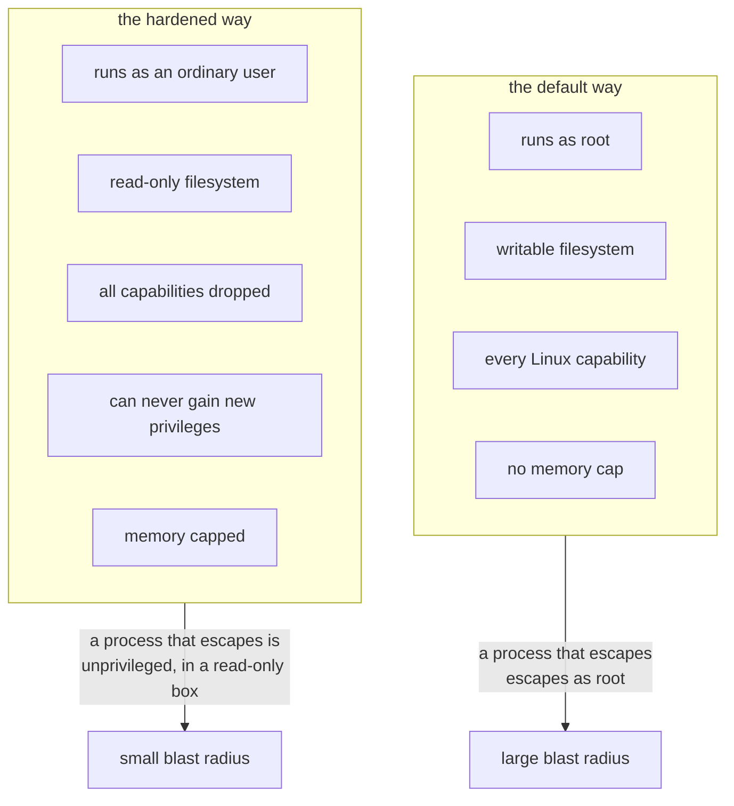
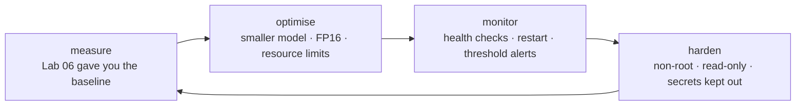
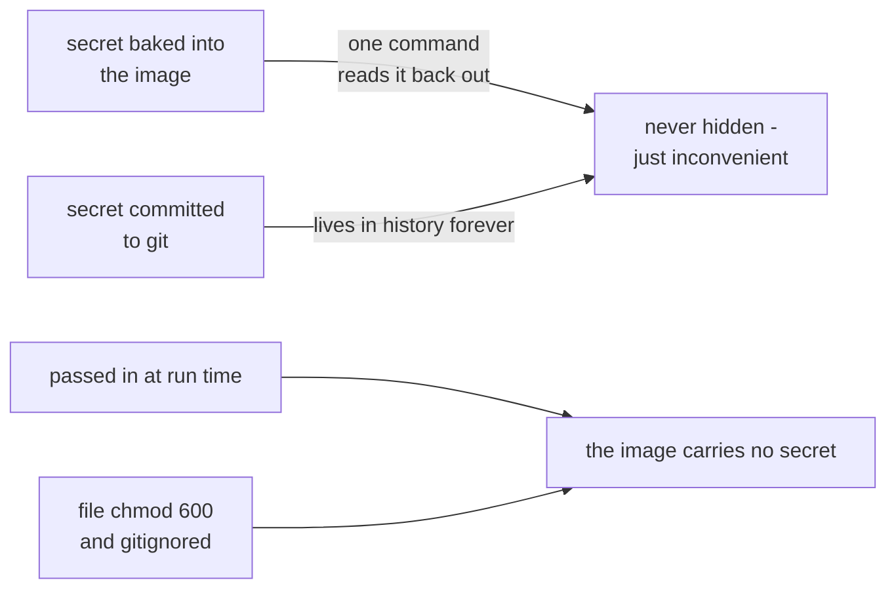

# 07 — Optimization, Monitoring, and Security

*Make it faster, notice when it breaks, and make it harder to attack.*

## In one sentence

You act on your benchmark — speed the model up and prove it with data — then add
the operational machinery a real deployment needs: services that report whether
they're alive, automatic recovery, alerts on bad readings, and containers
locked down so a break-in doesn't become a disaster.

## What this is really about

Three concerns that always arrive together once something actually works.

**Optimization.** The cheapest speedup is choosing a smaller model or a smaller
input image — which you already proved in benchmarking. Beyond that, the lab
uses **half precision**: doing the arithmetic with less numeric detail, which
graphics chips do considerably faster with only a small accuracy cost. You run
a baseline and two optimizations and compare, and crucially you check the
*accuracy* side too — if the detection count collapses to zero, congratulations,
you made a fast wrong answer.

**Right-sizing.** An optimized model still hogs a shared machine if you let it.
You set explicit processor and memory limits and then verify them at the
operating-system level, not by asking the program nicely. There's a genuinely
surprising detail here: from *inside* a limited container, the usual commands
still report the whole machine's resources. The limits are enforced from
outside. So you check the enforcement records, not the container's self-report.

**Security.** The framing is honest about what you control. Device-wide settings
belong to the instructor; you can inspect those. What's yours is your account
and your containers.

The container hardening comparison is the memorable part. Run one the default
way: it runs as the all-powerful root user, with a writable filesystem and every
permission available. Anything escaping that container escapes as root. Then run
it hardened — as an ordinary user, with a read-only filesystem, a small scratch
area, every unnecessary permission stripped, no way to gain new ones, and a
memory cap. Same program, vastly smaller blast radius.

Then there's the secrets lesson, which is taught by doing it wrong on purpose:
bake a password into a container image, then extract it straight back out of the
image's own metadata with one command. It was never hidden. Secrets get handed
in when the thing runs — never built into it, never committed to version
control.

The same container, run two ways. Same program, very different consequences if
something gets in:

## What you actually do

Optimize and measure. Set container limits and verify them. Check your own key
and folder permissions — too-open permissions are a real, common, boring
problem. Compare an insecure and a hardened container. Leak a fake secret and
recover it. Add a **health check** so a service reports whether it's alive and
a **restart rule** so a crashed one recovers by itself — then break it and watch
it come back. Finally build an **alerter** that watches the telemetry stream and
flags readings over a threshold, deciding locally without waiting on the cloud.

## Why it matters later

Health checks, restart policies, and heartbeats scale up to the whole fleet in
Lab 09. This is where you meet them one service at a time.

The three concerns are not a checklist, they are a loop — and it never stops
turning once something is deployed:

And the secrets lesson, taught by doing it wrong on purpose:

## Words you'll meet

- **Half precision (FP16)** — less numeric detail, more speed.
- **cgroups** — the operating-system mechanism that actually enforces limits.
- **Attack surface** — everything an attacker could target. Less software and
  fewer privileges means less of it.
- **Least privilege** — give a thing exactly what it needs and nothing more.
- **Health check** — a service's regular "yes, I'm working" signal.

## The one thing to remember

A secret inside an image is not hidden. It's just inconvenient to read.
