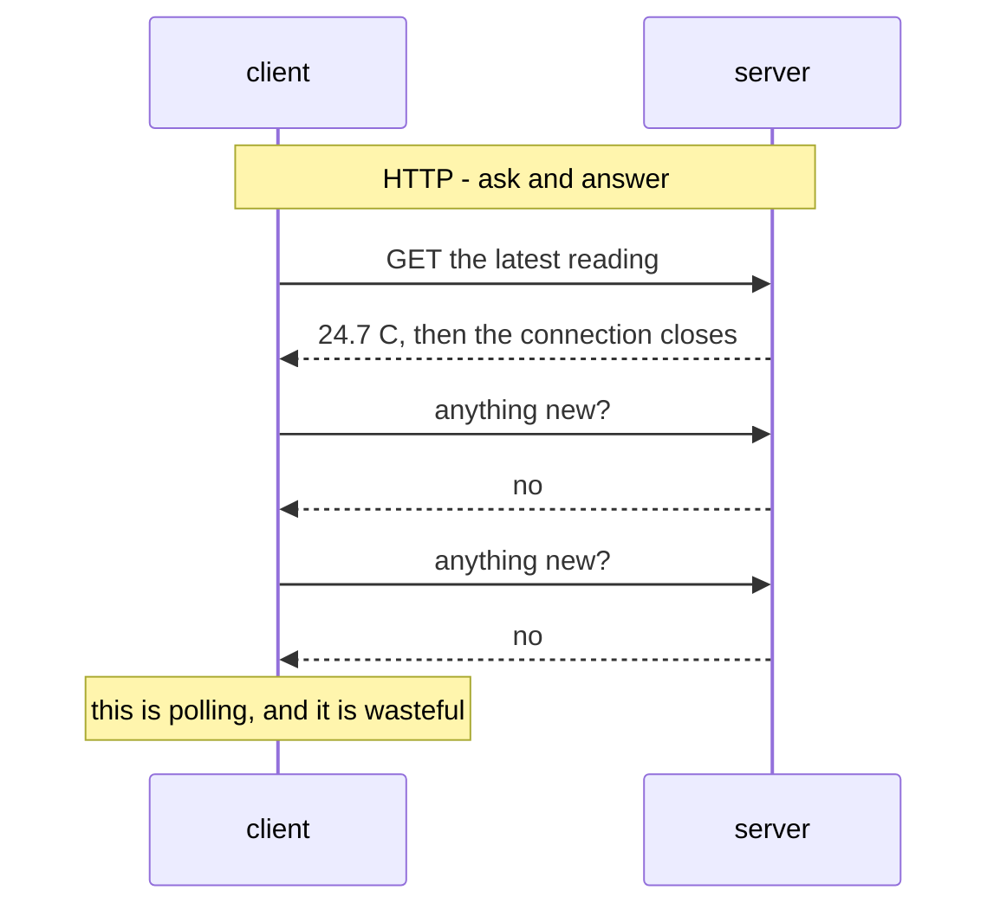
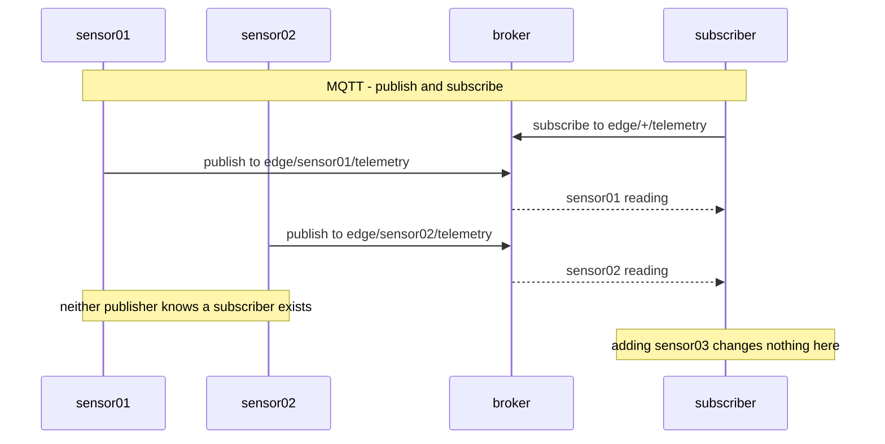
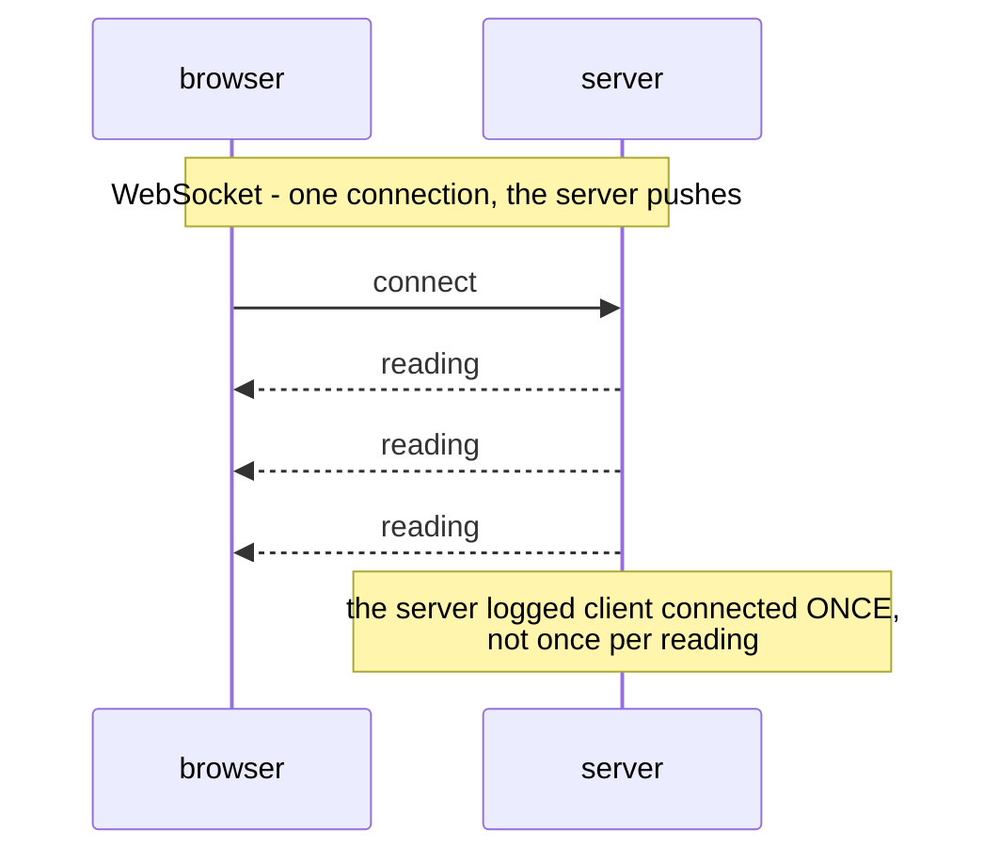
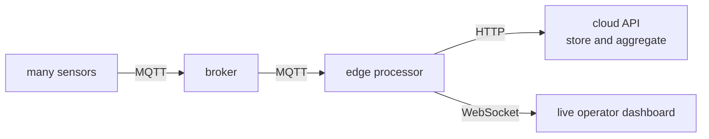
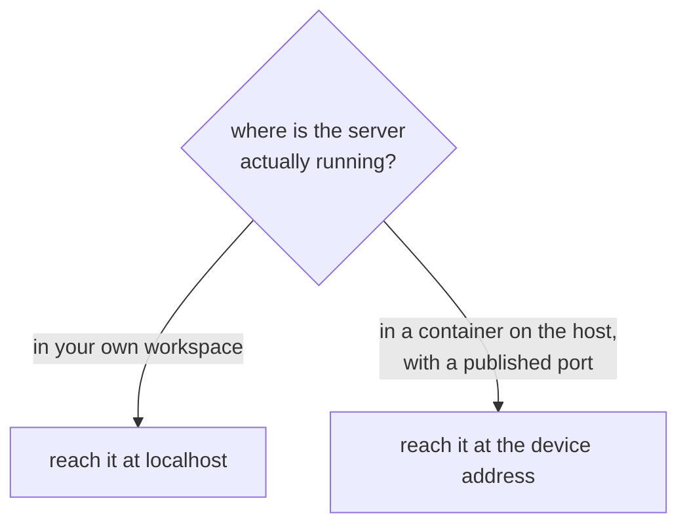

# 08 — How the Pieces Talk: HTTP, MQTT, WebSocket

*The same reading, sent three different ways, and why each way exists.*

## In one sentence

You move one sensor reading across three communication styles — ask-and-answer,
publish-to-a-middleman, and a permanently open two-way line — and see for
yourself which traffic patterns each one suits.

## What this is really about

Edge systems are made of parts that talk. *How* they talk is an architecture
decision, not a technical detail, and picking wrong is what makes a system
sluggish or unable to grow.

**HTTP** is ask-and-answer. A client asks a question, the server replies, the
conversation ends. Universal, simple, works everywhere. Its weakness: to notice
new data, the client has to keep asking. That's called **polling**, and it's
wasteful — like phoning someone every thirty seconds to ask if anything's
happened.

**MQTT** is publish-and-subscribe through a middleman called a **broker**.
Devices publish messages to a named **topic**; anyone interested subscribes to
that topic. The magic is that the sender and receiver never know about each
other — only about the broker and the topic name. That's what lets a hundred
sensors feed three applications without anyone maintaining a list of who talks
to whom. This is *the* classic pattern for connected devices.

**WebSocket** keeps a single connection open so the server can push data the
moment it changes. No asking. Ideal for a live dashboard in a browser. The cost
is that the server has to hold a live connection per viewer.

The three protocols, as three conversations. Watch who starts the talking:

## What you actually do

- **Three ports of your own**, since you're running three small servers.
- **HTTP:** run a small web server in one window, and from the notebook send it
  a request asking for a reading and another submitting one. Watch each request
  appear in the server's window.
- **MQTT:** run a broker in a container. Then, in two windows side by side, run
  a subscriber and a publisher — and watch messages appear in one window
  moments after being sent from the other, despite the two never having been
  connected to each other. Start a *second* publisher with a different device
  name and watch the same subscriber pick it up too, thanks to a wildcard in the
  topic name. That's the scaling property, demonstrated in about a minute.
- **WebSocket:** run a pushing server and connect to it. First prove three
  readings arrive without asking, then watch a single line on screen update
  itself once a second for ten seconds while the server logs "client connected"
  exactly *once* — not once per reading. That's the whole difference.
- **Compare all three** side by side and see the mixed pattern real systems
  actually use: MQTT from the sensors, HTTP to the cloud, WebSocket to the
  operator's screen.

There's a good teaching moment buried in here about *addresses*. A server you
start in your own workspace and a service running in a container on the host
machine are in different places, and they need different addresses to reach.
The lab is explicit about which is which and why, because getting this wrong is
one of the most common ways a working setup mysteriously refuses to connect.

## Why it matters later

Lab 09 builds its entire simulated fleet on the publish-subscribe pattern from
Part 4. This lab is why that design makes sense rather than seeming arbitrary.

Real systems mix all three, choosing per link rather than picking a favourite:

There is also an address trap worth internalising, because it is one of the
most common ways a correct setup refuses to connect:

## Words you'll meet

- **Broker** — the middleman that routes published messages to subscribers.
- **Topic** — a named channel, e.g. `edge/sensor01/telemetry`.
- **Wildcard** — a pattern matching many topics at once.
- **Polling** — repeatedly asking whether anything's new.
- **Duplex** — both sides can send whenever they like.

## The one thing to remember

Match the protocol to the traffic pattern. One-off command, many-to-many
stream, and live push are three different problems.
