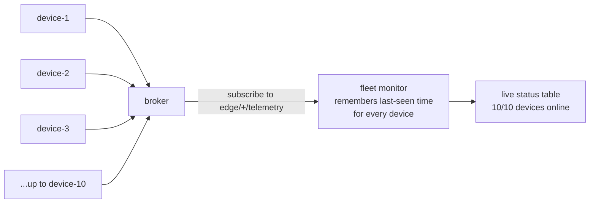
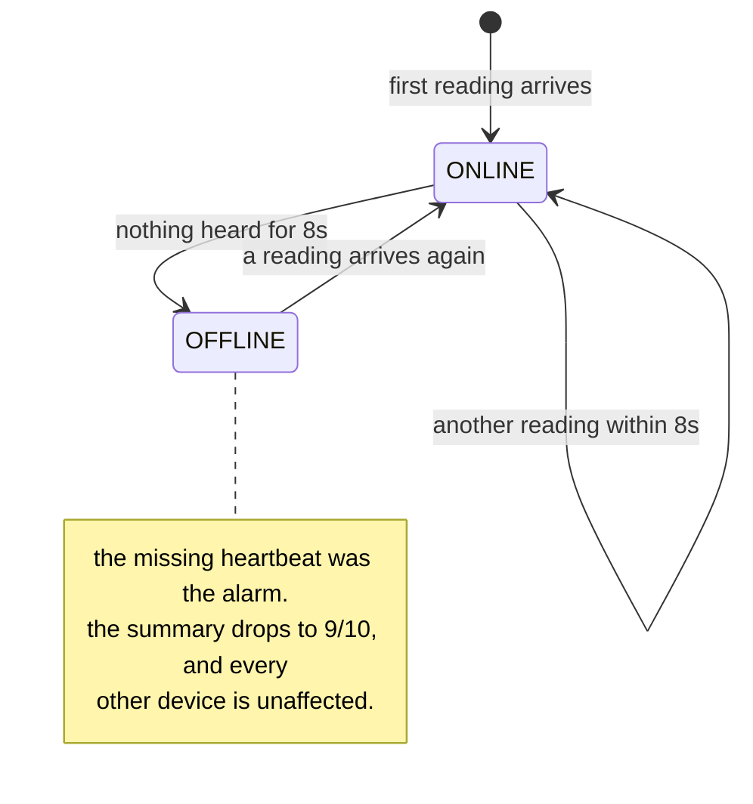
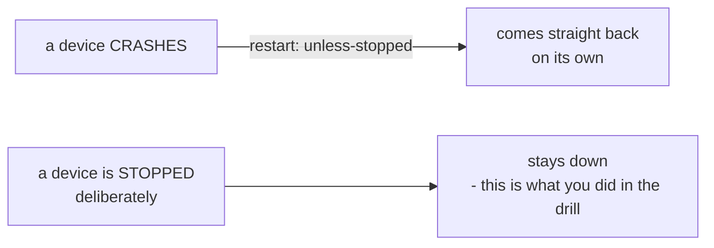

# 09 — Fleet Simulation and Monitoring

*The capstone: one device is easy, a hundred is a different job.*

## In one sentence

You simulate a whole fleet of edge devices reporting in over the network, build
a central monitor that tracks all of them at once, watch it catch a device that
silently dies, and scale the fleet up and down with a single command.

## What this is really about

Everything up to now ran on one machine. Real deployments have many — in
vehicles, buildings, factories — and scale changes what the problems even are:

    One device                      A fleet
    -----------                     -------
    you read its logs               you cannot read hundreds of logs
    you know it's running           devices fail silently
    you log in to update it         you need to update many at once
    one identity                    every device needs its own

The pattern that scales is the one from Lab 08: each device **publishes** its
readings, tagged with its own identity, to a broker. A central **monitor**
subscribes to all of them at once with a wildcard. Devices don't know about each
other or about the monitor. Adding a device changes nothing anywhere else, which
is precisely why it scales.

The other key idea is the **heartbeat**. You don't ask a device if it's alive —
you notice it stopped talking. Here each telemetry message doubles as the
heartbeat, and the monitor marks a device OFFLINE when nothing has arrived from
it within a few seconds. This is how silent failures get caught with nobody
watching.

No device knows about any other device, or about the monitor. That is exactly
why adding the eleventh costs nothing.

## What you actually do

- **Build the simulated device** — a small program that publishes a reading
  every couple of seconds, tagged with an identity that defaults to its own
  container's name. Which means one image becomes an entire fleet, each copy
  automatically distinct.
- **Build the monitor** — subscribes to every device's topic at once, remembers
  when each was last heard from, and prints a live status table.
- **Wire it together** and start it with **five** devices. Confirm seven things
  running: a broker, a monitor, and five identical devices.
- **Watch the live table** in a terminal — one row per device, its age, its
  latest values, and a summary line reading `5/5 devices online`.
- **Scale to ten** with one command. No code changes, no new files. Watch the
  table grow. That's the core idea of orchestration: change how many are
  running without touching the application.
- **Kill one device on purpose** while watching the monitor in another window.
  Within seconds its row flips to OFFLINE, its age keeps climbing, the summary
  drops to `9/10`, and every other device is unaffected. The heartbeat did the
  work — nobody was reading individual logs.

There's a nice subtlety: because the devices have an automatic restart rule, a
device that *crashes* comes straight back. You had to explicitly stop one to
make it stay down. Crash recovery and true failure are different events, and
the system distinguishes them.

## Why it matters

This is the capstone because it uses nearly everything: containers and
multi-container systems from Labs 00 and 02, the telemetry format from Lab 03,
publish-subscribe from Lab 08, health and heartbeats from Lab 07. Optionally the
whole fleet's data can flow into the database and dashboard from Lab 04.

Real platforms — Kubernetes, k3s, the big cloud IoT services — add more on top:
rolling updates so a fleet is upgraded a few at a time and never fully goes
down, deciding which workload runs on which device, remote configuration. The
underlying patterns are the ones you just built by hand.

How a silent failure gets caught with nobody reading logs:

Worth separating two things that look the same from the outside:

## Words you'll meet

- **Fleet** — many devices managed together as one system.
- **Orchestration** — running, scaling, updating, and recovering many things as
  a group.
- **Heartbeat** — a regular "I'm alive" signal; its absence is the alarm.
- **Replica** — one of N identical copies of a service.
- **Rolling update** — upgrading a fleet gradually so it never fully stops.

## The one thing to remember

At fleet scale you don't watch devices. You watch for the ones that stopped
talking.
