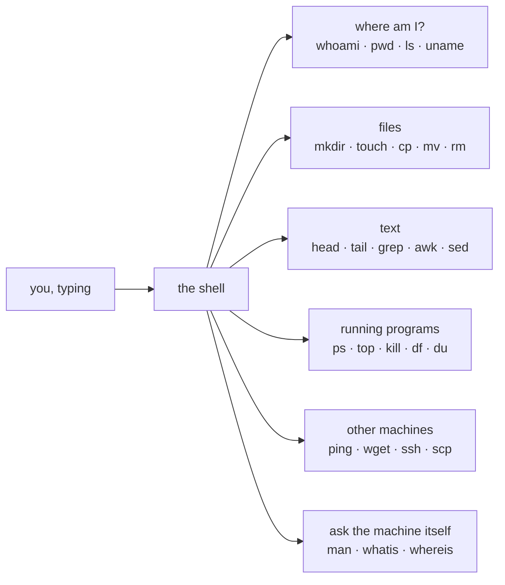
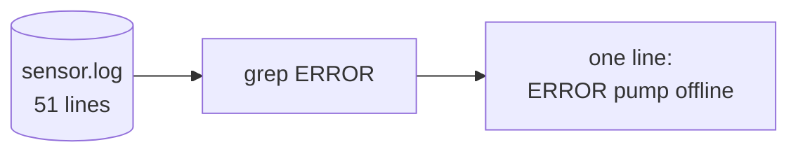

# AA — Linux Command Basics

*Your first hour talking to a computer by typing.*

## In one sentence

Before you can build anything on the class machine, you need to be able to
tell it what to do with typed commands instead of mouse clicks — and this lab
walks you through the handful of commands that carry the entire rest of the
course.

## What this is really about

Most people meet a computer through windows and icons. Professionals who run
servers and small devices mostly don't. They type. Typing is faster, it can be
written down and repeated, and — this is the important part — it works on a
machine sitting in a closet a thousand miles away that has no screen attached.

So this lab is the vocabulary lesson. Nothing here is clever. It's the
equivalent of learning "where is the bathroom" before you travel.

## What you actually do

You work through nine short sections, running each command and looking at what
comes back:

1. **Where am I?** — ask the machine your username, what folder you're standing
   in, what's in that folder, and what kind of computer it is.
2. **Making and moving files** — create folders, write a line of text into a
   file, copy it, rename it, delete it. This is most of a working day.
3. **Reading and searching text** — you generate a fake sensor log with 50
   readings and one hidden error line, then find that one line. Real
   troubleshooting is almost entirely this: finding the one line that matters
   in a file of thousands.
4. **Permissions** — you write a tiny script, then flip the switch that makes a
   file "runnable," and run it. Files carry rules about who may read, change,
   or run them.
5. **What's running** — list the programs currently active, check free disk
   space, start a harmless background job and then stop it on purpose.
6. **Reaching other machines** — check if another computer answers, download a
   file from the web.
7. **Getting help** — how to make the machine explain a command to you, so you
   never have to guess or ask.
8. **Text power tools** — two old, strange, extremely useful programs that pull
   columns out of text and do find-and-replace on the fly.
9. **Packing things up** — squash a whole folder into one file you can move or
   back up.

## Why it matters later

Every later lab assumes you can do these things without being told. When Lab 03
says "watch the collector stream readings," it assumes you know how to open a
terminal, run a script, and press Ctrl-C to stop it. This lab is where that
becomes automatic.

The single most useful habit in the whole lab is chaining small tools together,
each one narrowing what the next one sees:

Each program does one small thing. The pipe is what makes them powerful.

## Words you'll meet

- **Shell / terminal** — the text window where you type commands. The one in
  the notebook and the one in the Terminal tab are the same machine.
- **Directory** — a folder.
- **Script** — a file containing a list of commands, so you can run them all
  again later without retyping.
- **Permissions** — the rules on a file saying who may read it, change it, or
  run it.
- **Process** — one running program.

## The one thing to remember

You can't break anything here, so try things. If you don't know what a command
does, the machine will tell you — ask it before you run it.
