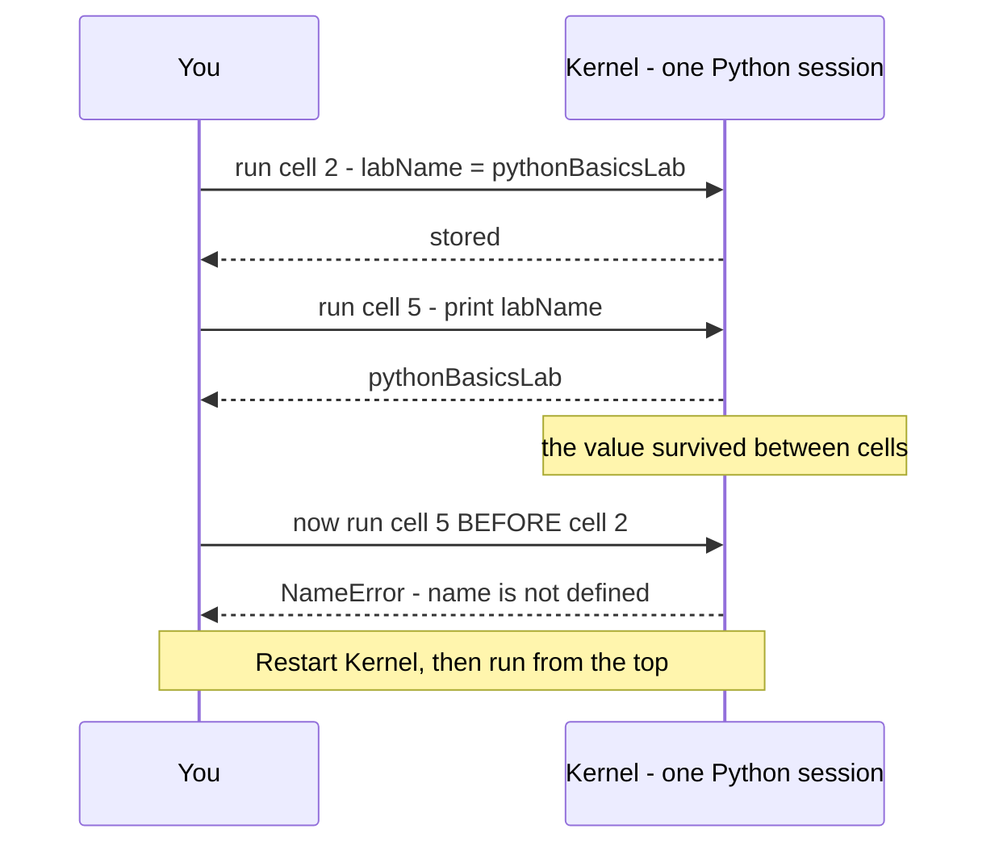
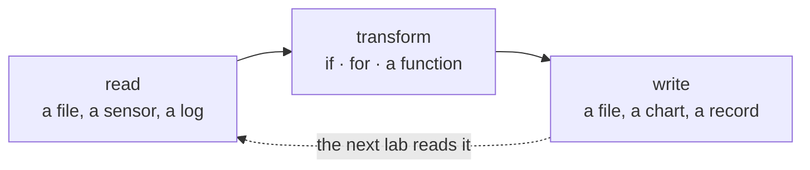

# BB — Python and Jupyter Notebooks

*Your first hour writing code, in the kind of document you're reading right now.*

## In one sentence

Every lab after this one is a notebook full of Python, so this lab teaches you
how a notebook thinks and how to read the small pieces of Python the other labs
are made of.

## What this is really about

A **notebook** is a document you can run. It's part written explanation, part
live code, and the code boxes produce their answers right underneath
themselves. It's how scientists and engineers show their work — you can read
the reasoning and re-run the calculation in the same place.

The twist that confuses everyone at first: a notebook has a memory. Behind the
page sits a single running Python session called the **kernel**. Anything you
define in one box is remembered by every box you run afterward — and cells run
in the order *you* run them, not top-to-bottom on their own. That's the source
of nearly every "but it worked a minute ago" moment. The escape hatch is
Restart Kernel, then run from the top.

The kernel is the part that surprises people. It is one running Python session
sitting behind the page, and it remembers everything — in the order **you** ran
things, not the order they appear:

## What you actually do

Eight short sections, each building a small file in your own folder:

1. **Cells and the kernel** — run a box, define a value, watch the next box
   remember it.
2. **Numbers and text** — the difference between `3` and `"riverside"`, and how
   to glue values into a sentence.
3. **Lists and dictionaries** — the two containers everything in this course
   travels in. A list is things in order. A dictionary is labelled values, like
   a form with named fields.
4. **Decisions and loops** — `if` chooses, `for` repeats. Together, a few lines
   handle a whole stream of readings instead of one.
5. **Functions and imports** — bundle a few lines under a name so you can use
   them again; pull in code other people already wrote.
6. **Reading and writing files** — write, read back, list what you made. Nearly
   every lab is some version of this loop.
7. **When things break** — you're asked to trigger an error *on purpose*, so
   you learn the shape of one. The important part of an error message is the
   last line; everything above it is the trail of how Python got there.
8. **A quick chart** (optional) — turn four numbers into a line graph and save
   it as an image.

## Why it matters later

The setup box at the top of every later lab is real Python doing real things —
importing tools, reading your username, deciding your port number. If that box
is meaningless to you, you'll be running the labs blind. After this one it
isn't meaningless.

The shape almost every later lab takes, once you strip the topic away:

## Words you'll meet

- **Cell** — one box in the notebook. Shift+Enter runs it.
- **Kernel** — the Python session behind the page that remembers everything.
- **Variable** — a name holding a value.
- **List** — items in order: `[21.5, 22.1, 20.8]`.
- **Dictionary** — labelled values: `{"site": "riverside", "cpus": 20}`.
- **Function** — a named block of code you can run again and again.
- **Traceback** — the error report Python prints when something goes wrong.

## The one thing to remember

An error is not a failure, it's a message. Read the last line first.
