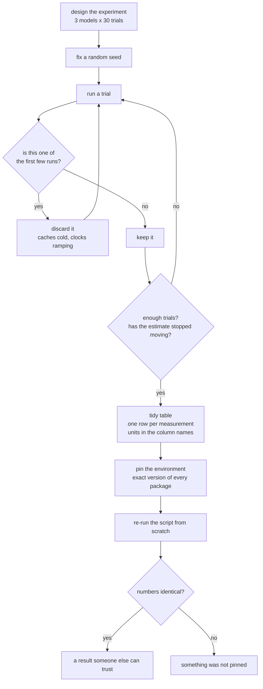
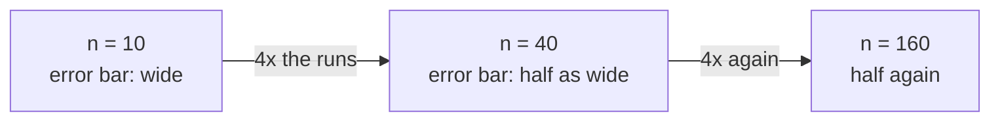

# CC — Making Data Worth Plotting

*How to run an experiment properly, before you have anything real to measure.*

## In one sentence

You practice the full habits of a careful measurement — decide what you're
measuring, decide how many times, record it cleanly, and package it so someone
else can reproduce it exactly — using made-up but realistic numbers, so the
habits are in place before the real measurements arrive in later labs.

## What this is really about

Two ideas, and both are about *trust*.

**A result nobody can reproduce isn't a result.** If you ran something once and
got 11 milliseconds, you don't have a measurement, you have an anecdote. Real
measurement means: throw away the first few runs (machines are slow while they
warm up, exactly like a car engine), then run it many times, then report both
the typical value *and* how much it wobbled.

**"How many runs?" has a real answer.** The lab has you watch the estimate
settle as you add more runs: 1 run is noise, 3 is barely better, by 30 it has
mostly stopped moving. There's a rule of thumb underneath: to halve your
uncertainty you need *four times* as many runs. The course's practical answer
is at least 30 after warm-up.

## What you actually do

You invent a small experiment — three AI models of increasing size, measured 30
times each — and generate numbers with realistic behaviour: bigger models are
slower, draw more power, and run hotter. Then:

- **Record it tidily.** One row per measurement, one column per thing measured,
  and the *units in the column name* so nobody ever has to guess whether
  "temp" means Celsius or Fahrenheit. Save it as a spreadsheet file and as a
  streaming-friendly format, plus a small note describing what each column
  means.
- **Pin the environment, the classic way.** Move the experiment out of the
  notebook into a standalone script, build it a private box of software
  packages, and write down the exact version of everything used. Anyone with
  that list gets the same versions you had.
- **Pin it again, the fast way.** The same job in one modern tool that does all
  of it in a single command, which is what this course's servers actually use.
- **Prove it worked** — re-run the script and check the reproduced numbers
  match the originals exactly, then sanity-check for impossible values (no
  negative times, no 130% utilization, no blanks).

## Why it matters later

The performance labs generate real numbers, and this lab is where you learn
what to *do* with numbers so they're defensible. The next lab (DD) turns this
exact dataset into figures.

Why 30 and not 5? Because uncertainty shrinks with the *square root* of the
number of runs — so each halving costs you four times the work:

Thirty is where the curve has mostly flattened for the cost.

## Words you'll meet

- **Random seed** — a starting point for randomness that makes "random" numbers
  come out identical every time. It's what makes a simulated experiment
  repeatable.
- **Warm-up** — the first few runs, thrown away because the machine hasn't
  settled yet.
- **Percentile (p95, p99)** — the value 95% or 99% of runs came in under. The
  slow tail, which often matters more than the average.
- **Tidy data** — one row per measurement, one column per variable.
- **Virtual environment** — a private set of software packages for one project,
  so projects can't break each other.
- **Lock file** — the exact recorded version of every package used.

## The one thing to remember

An average with no spread beside it is half a number.
