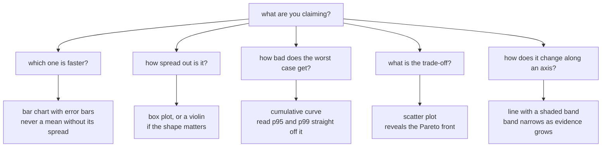
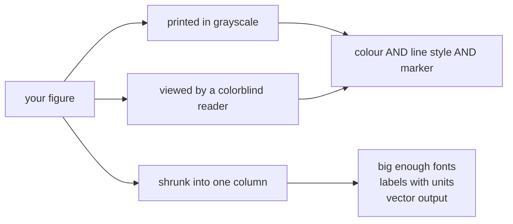

# DD — Figures You Could Put in a Paper

*A chart is an argument. This is how you make one that wins.*

## In one sentence

You take the dataset from the previous lab and turn it into figures that are
honest, readable, and professional — the right chart for each claim, one
consistent look across all of them, and colors that still work for a colorblind
reader or a black-and-white printout.

## What this is really about

Most people treat a chart as decoration added at the end. It isn't. A good
figure makes your finding obvious in about three seconds, and it survives being
shrunk into a narrow column or printed without color. A bad one quietly hides
your result, or worse, misleads.

The core discipline: **match the chart to the claim you're making.** Each chart
type answers a different question, and using the wrong one isn't a style
mistake, it's an accuracy mistake.

Every chart type answers a different question. Pick the chart from the claim,
not from habit:

## What you actually do

You set one house style once — fonts, sizes, a colorblind-safe color set — so
every figure in the set looks like it belongs with the others. Consistency is
about half of what makes work look professional.

Then you build one figure per question:

- **"Which is faster?"** → a bar chart, with error bars. The bar is the
  average, the little line through it is how much it varied. Never show an
  average without its spread.
- **"How spread out is it?"** → a box plot, which shows the middle, the middle
  half, and the outliers a bar chart would hide.
- **"How bad does it get?"** → a cumulative curve, which lets you read off what
  fraction of runs finished under any given time. For anything with a deadline,
  the worst 5% is the story, not the average.
- **"What's the trade-off?"** → a scatter plot of two measures against each
  other, which reveals the set of best available compromises.
- **"How does it change along an axis?"** → a line with a shaded band showing
  the uncertainty, narrowing as evidence accumulates.

Then you make them **publication-safe**. Three rules cover most of it: encode
every distinction twice (color *and* a different line style or marker, so it
survives grayscale); label everything with its units; and write a caption that
states the finding, not just what the axes are.

Finally you group related plots into one multi-panel figure with labelled parts
(a), (b), (c), and export everything twice — a sharp-at-any-size version for
print, and an ordinary image for slides.

The last three sections introduce two more tools alongside the main one: one
that turns common statistical plots into a single line of code, and one where
you *describe* what you want and get an interactive chart you can hover and
zoom.

## Why it matters later

Every measurement you make in the rest of the course ends up needing a picture,
and the style helpers introduced here get reused. It's also, frankly, the skill
that makes a class project look like engineering rather than homework.

The publication-safe test, in one picture. A figure has to survive all three:

## Words you'll meet

- **Error bar** — the line showing how much a measurement varied.
- **Box plot** — a compact picture of a distribution's middle and outliers.
- **CDF (cumulative curve)** — "what fraction of runs finished under this time?"
- **Pareto front** — the set of options where you can't improve one thing
  without giving up another.
- **Vector vs. raster** — vector art stays sharp at any size (good for print);
  raster is a grid of pixels (fine for slides and the web).

## The one thing to remember

If your figure only works in color, it doesn't work.
