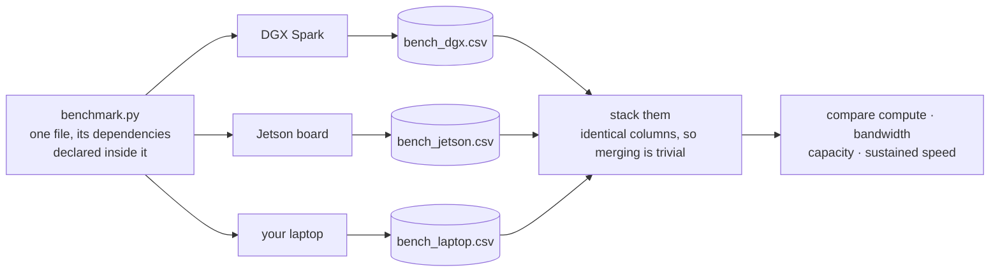
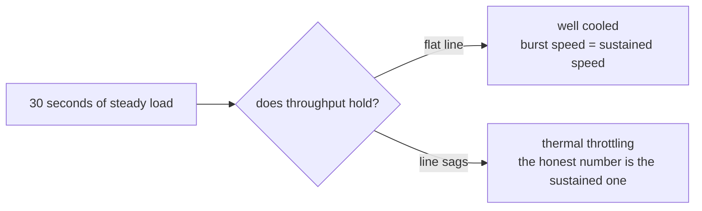

# EE — Comparing Two Very Different Machines

*A benchmark number means nothing on its own.*

## In one sentence

You write one small speed test, run it on the big class machine and on some
other machine you can reach, then merge the results and compare them fairly —
which is the whole point, because "356 GFLOP/s" is meaningless until it sits
next to another machine's number from the same test.

## What this is really about

This is the payoff lab for the on-ramp. It uses everything from AA through DD:
you drive the machine from the shell, write the code in Python, run it as a
clean reproducible experiment, and plot the comparison in the house style.

The engineering idea is that comparisons are only honest when the test is
identical. So the benchmark is deliberately one small self-contained file, with
its software requirements written at the top, that builds its own clean
environment wherever it lands. The same single command runs it on a big
workstation, a tiny edge board, or a laptop.

It measures three things every computer has, so nothing gets skipped on a
machine without a fancy graphics chip:

- **Raw math speed** — how fast it multiplies big grids of numbers.
- **Memory speed** — how fast it can move a large block of data around.
- **Interpreter overhead** — how fast plain Python runs a tight loop. This one
  barely changes with hardware, which is itself the lesson: some costs are
  Python's, not the machine's.

It also records what machine it ran on — name, chip type, core count, memory,
power — so merged results stay labelled.

## What you actually do

Run it here. Copy the single file to a second machine (a small NVIDIA edge
board, or your own laptop), run the same command there, copy the small result
file back. Stack the two result files together — which is trivial, because the
previous labs taught you to record data tidily — and compare.

Then you make the comparison figures: which machine computes fastest, how many
times faster is the big one, and a different kind of advantage entirely — **how
much it can hold.** The class machine's very large shared memory pool can run
models a small board simply cannot fit at all, at any speed. Capacity and speed
are two different axes and it's worth seeing both.

There's an honesty note built into the lab: the graphics-chip number is
measured at a different numeric precision than the processor number, so it
isn't a clean multiple. The lab says so out loud rather than quietly reporting
a flattering ratio.

The last part runs a steady load for about 30 seconds and watches whether speed
*holds*. Small devices heat up and quietly slow themselves down to stay cool. A
well-cooled machine doesn't. That gap between burst speed and sustained speed
is one of the defining facts of edge computing.

## Why it matters later

The whole course is about what you can and can't do on a small machine near
where the data is made. This lab is where that stops being an assertion and
becomes a measurement you took yourself.

The last part measures the thing a single quick run always hides:

## Words you'll meet

- **Benchmark** — a repeatable test used to compare machines fairly.
- **GFLOP/s** — billions of arithmetic operations per second.
- **Bandwidth** — how fast data can be moved, as opposed to how fast it's
  computed on.
- **Unified memory** — one pool of memory shared by the processor and the
  graphics chip, instead of two separate pools.
- **Throttling** — a machine deliberately slowing down to avoid overheating.

## The one thing to remember

Same test, same way, or it isn't a comparison.
